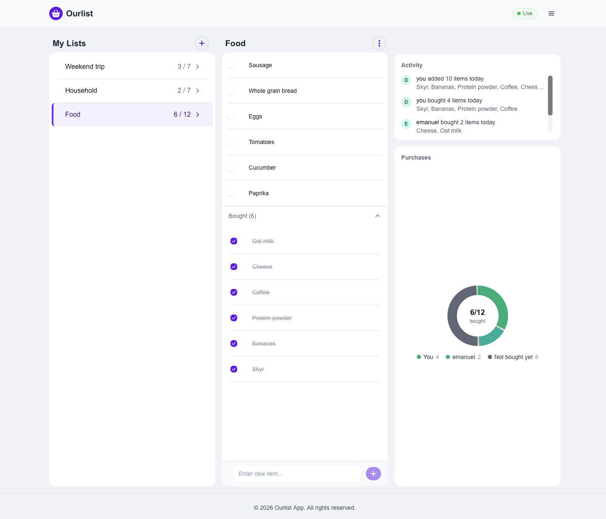
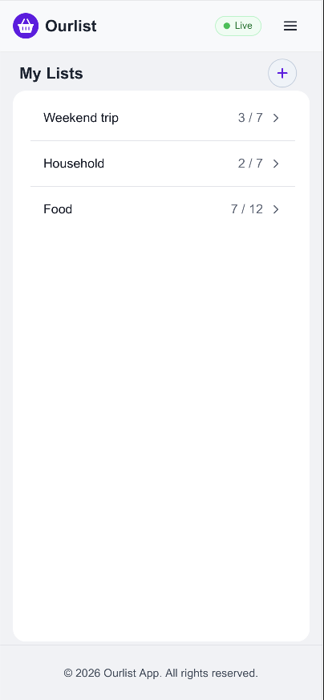
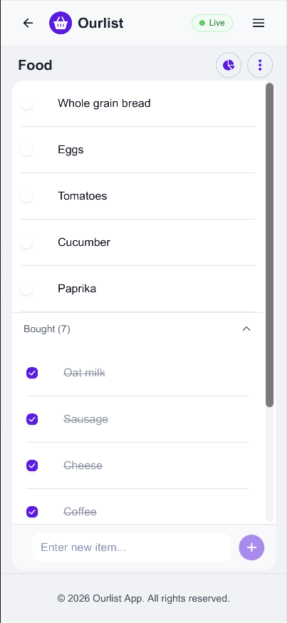
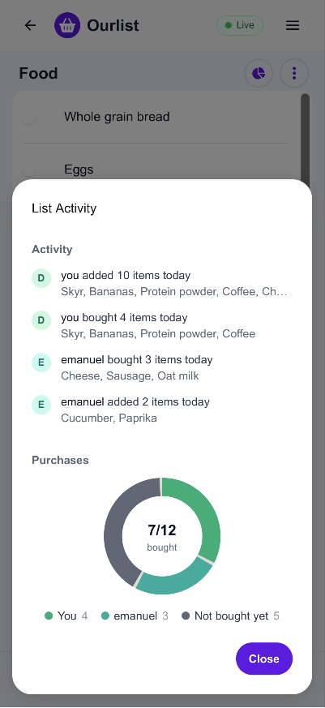
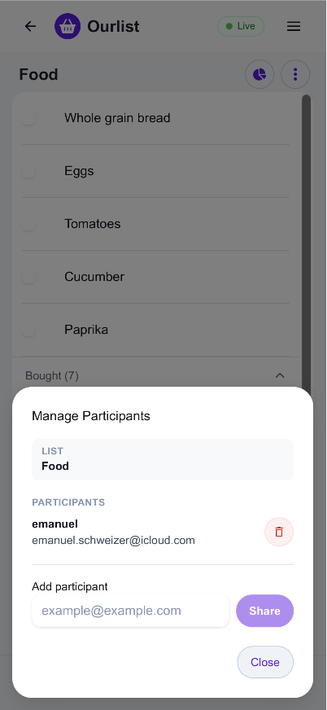
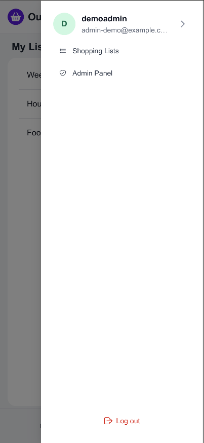
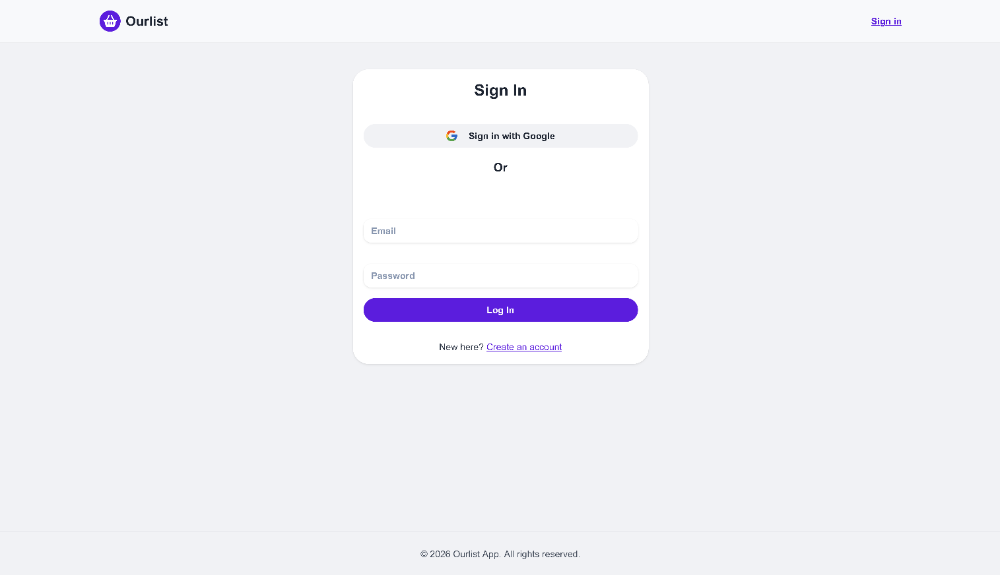
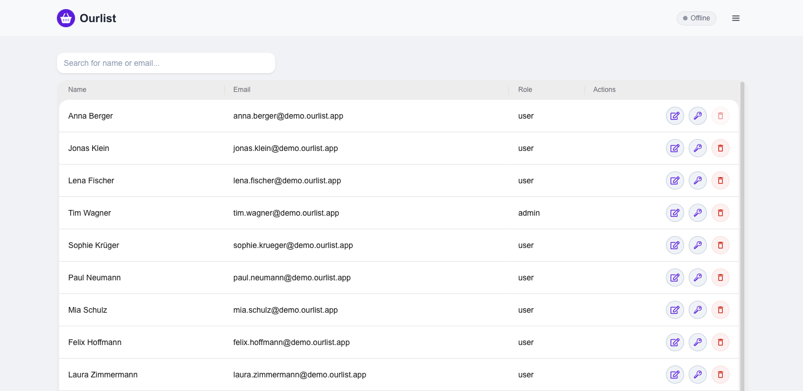

# Ourlist

Shared shopping lists with real-time sync. Create a list, share it with
someone, and both see changes as they happen.

> **Work in progress** — the backend API is complete and deployed.
> The frontend is under active development.

## Screenshots

  

The main view on desktop: your lists on the left, the open list in the middle,
and on the right the activity feed and a chart of who bought what. The green
"Live" badge in the top right means live updates are connected.

### On the phone

<table>
  <tr>
    <td align="center"> My lists with bought / total</td>
    <td align="center"> A list, bought items are collapsed below</td>
    <td align="center"> Activity and chart for one list</td>
  </tr>
  <tr>
    <td align="center"> Share a list and manage participants</td>
    <td align="center"> Menu with admin panel</td>
    <td></td>
  </tr>
</table>

### Sign in and admin

<table>
  <tr>
    <td align="center"> Sign in with email or Google</td>
    <td align="center"> Admin panel (demo users, read-only for the demo admin)</td>
  </tr>
</table>

## Features

- **Lists & items** — create, rename, and delete lists (with confirmation);
  add, check off, and remove items
- **Live updates** — when someone adds, renames, checks off or removes an item,
  everyone who has the list open sees it right away. The navbar shows whether
  the connection is up ("Live" or "Offline")
- **Sharing** — share a list with other users by email and manage
  participants (add/remove) from a dedicated modal
- **Activity feed** — a per-list, per-day log of who added or bought which
  items
- **Purchase chart** — a donut chart breaking down bought vs. remaining
  items per participant
- **Auth** — sign up, sign in (credentials or Google), automatic token
  refresh
- **Admin panel** — manage users (edit, update password, delete)

## Status

| | |
|---|---|
| Backend API | Complete, deployed on Railway |
| Auth (sign up, sign in, refresh) | Done |
| Admin panel | Done |
| Lists & items | Done |
| List sharing & participants | Done |
| Activity feed & purchase chart | Done |
| Real-time sync (SignalR) | Done for list items |

## Tech stack

Next.js (App Router), TypeScript, HeroUI, Tailwind, NextAuth, Zustand, SignalR
client, Jest

Backend: [Ourlist_WebAPI](https://github.com/EmanuelSchweizer/Ourlist_WebAPI) —
ASP.NET Core (.NET 10), PostgreSQL, EF Core.

## Architecture

- Feature-based structure (`features/<domain>/` with `actions.ts`, `hooks`, `components`)
- Server-side data fetching; the API key never reaches the client
- Server Actions for mutations, typed result objects instead of thrown errors

## How live updating works

`SocketConnection` (on the main page) connects to the SignalR hub of the
backend and joins a group for every list the user has loaded. When an item is
added, changed or removed, the backend sends an event and the handlers write it
into the Zustand store.

- The JWT only lives on the server, so the browser gets it from a small route
  (`/api/signalr-token`) when it connects.
- You get your own changes back as events too. That's why `addListItem` in the
  store ignores items that are already there.
- Only list items are live. Renaming or sharing a list itself needs a reload
  on the other side.
- The hub URL comes from `NEXT_PUBLIC_SIGNALR_URL` (defaults to
  `http://localhost:8080/hubs/shoppingList`). It has to be the public URL of the
  backend, since the browser connects directly. The value is built into the
  bundle, so after changing it you need a new build.
